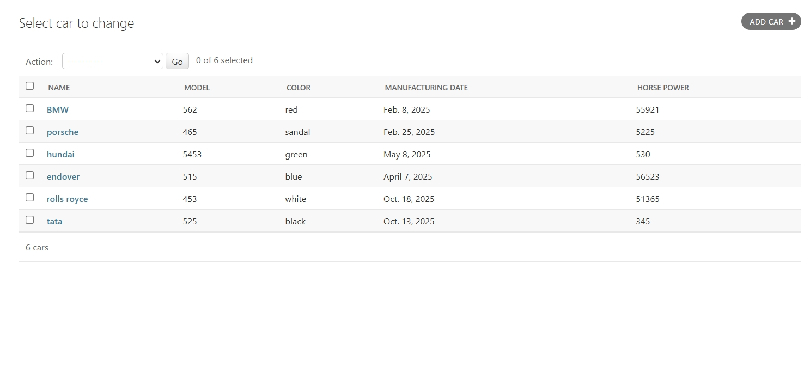

# Ex02 Django ORM Web Application
## Date: 

## AIM
To develop a Django application to store and retrieve data from a Car Inventory Database using Object Relational Mapping(ORM).

## ENTITY RELATIONSHIP DIAGRAM


## DESIGN STEPS

### STEP 1:
Clone the problem from GitHub

### STEP 2:
Create a new app in Django project

### STEP 3:
Enter the code for admin.py and models.py

### STEP 4:
Execute Django admin and create details for 10 books

## PROGRAM
```
models.py
from django.db import models
from django.contrib import admin

class Student(models.Model):
    name = models.CharField(max_length=255, help_text="Student Name")
    ref_no = models.CharField(max_length=50, unique=True, help_text="Reference Number")
    department = models.CharField(max_length=100, help_text="Department (e.g., CSE, ECE, MECH)")
    year = models.IntegerField(help_text="Year of Study (e.g., 1, 2, 3, 4)")
    email = models.EmailField(help_text="Email Address")
    dob = models.DateField(help_text="Date of Birth")

class StudentAdmin(admin.ModelAdmin):
    list_display = ('name', 'ref_no', 'department', 'year', 'email', 'dob')
# Create your models here.

admin.py

from django.contrib import admin
from .models import Student, StudentAdmin

admin.site.register(Student, StudentAdmin)
```
## OUTPUT

Include the screenshot of your admin page.


## RESULT
Thus the program for creating car inventory database database using ORM hass been executed successfully
